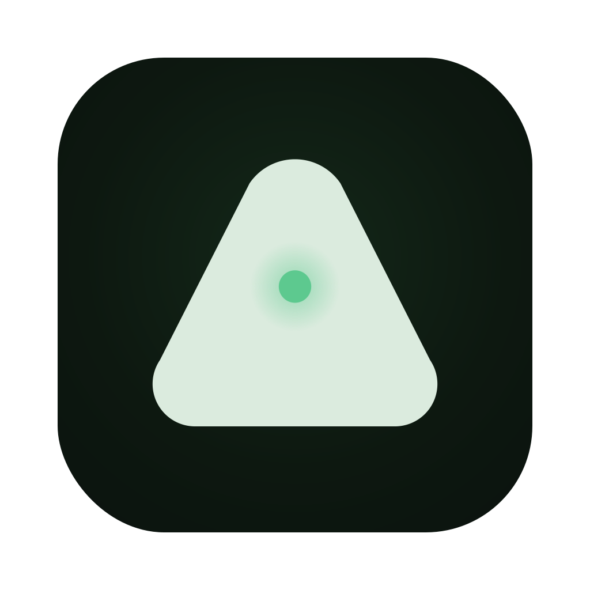

<p align="center">
  
</p>

<h1 align="center">
  
  Yoda
</h1>

<p align="center">
  <strong>Your Orchestra of Delegated Agents</strong><br>
  <sub>Harness for your Agent Workspace——把 Claude Code、Codex、Gemini 等 31 种客户端收进同一个工作区：按任务挑选、并行开工、互相 review，Skills / Hooks / Memory / 上下文尽收眼底。</sub>
</p>

<div align="center">

[](./LICENSE.md)
[](https://github.com/lovstudio/yoda/releases)
[](https://github.com/lovstudio/yoda)
[](https://github.com/lovstudio/yoda/commits/main)
[](https://github.com/lovstudio/yoda/graphs/commit-activity)
<br>
[](https://twitter.com/intent/follow?screen_name=lovstudio)

<br>

  <strong>
    <a href="https://github.com/lovstudio/yoda/releases/latest/download/yoda-arm64.dmg">macOS Apple Silicon</a>
    ·
    <a href="https://github.com/lovstudio/yoda/releases/latest/download/yoda-x64.dmg">macOS Intel</a>
    ·
    <a href="https://github.com/lovstudio/yoda/releases/latest/download/yoda-x64.msi">Windows</a>
    ·
    <a href="https://github.com/lovstudio/yoda/releases/latest/download/yoda-x86_64.AppImage">Linux AppImage</a>
  </strong>

<br><br>

[文档](https://yoda.lovstudio.ai/docs) · [设计语言](https://yoda.lovstudio.ai/design/) · [为什么选择](#why-yoda) · [亮点](#highlights) · [安装](#installation) · [客户端](#providers) · [架构](#architecture) · [技术栈](#tech-stack) · [贡献](#contributing) · [FAQ](#faq)

</div>

<br>

<a id="why-yoda"></a>

## 为什么选择 Yoda

Harness 是 agent 与真实世界之间的那一层：进程、会话、Skills、Hooks、Memory、上下文。agent 的表现好不好，一半取决于模型，另一半取决于这层 harness 搭得好不好。Yoda 把这一层做成了产品。

**工具太多，工作区只有一个。** 每家 coding agent 各有所长，但各开各的终端、各管各的会话。Yoda 统一编排 31 种客户端：按任务选择、会话随时恢复、跑对比和 review；Linear、GitHub、Jira 等工单直接进入会话，CI/CD 状态就在 diff 旁边。

**你的工作流，而不是工具的工作流。** 想快就主分支直跑——不建分支不开 worktree，开任务、AI 干活、归档收尾，归档前还能自动执行你预设的 Skill（比如让 agent 把它改过的文件提交好）；想稳就分支隔离——每任务一个 git worktree，并行互不干扰，diff 审查后合并；还有对比、review、team 模式应对更复杂的协作。

**Agent 不再是黑盒。** 提示词只是表层，agent 的实际行为由它加载的 Skills、Hooks、Memory 和上下文决定。Yoda 把这条链路完整摊开：逐项查看、按需覆写，行为不对劲时能找到原因——多数"agent 变笨了"的问题出在这层，而不是模型。

> 术语：本文把 Claude Code、Codex 这类"安装在你机器上的编码 agent CLI"统一称为**客户端**（旧称 Runtime）。

<a id="highlights"></a>

## 亮点

> **一个桌面应用，承载从 vibe coding 到多客户端协作的全部工作流。** 不绑定模型，不绑定厂商，本地优先。

核心差异点：

- **31 种客户端**：Claude Code、Codex、Gemini、Cursor、Copilot、Amp、OpenCode 等 [全部客户端](#providers) 按任务自由切换，统一管理会话与恢复。
- **运行模式**：normal / brainstorm / compare / review / team——多个客户端同时干活、互相审查、按角色分工。
- **自定义 Agent**：System Prompt + Skills + 首选模型组合成可复用角色，**不绑定任何客户端**——换 CLI 不用重写资产。
- **Harness 观测**：每个客户端的 Skills、Hooks、Memory 文件、会话上下文逐项检查，hooks 支持覆写与持久化。
- **归档前 Skill**：归档任务前自动执行你预设的 skill / 命令，把收尾动作（提交代码、更新文档、发通知）固化进流程。
- **工单到会话**：Linear、Jira、GitHub/GitLab/Forgejo Issues、Plain 的 ticket 直接作为新会话提示词，CI/CD 状态在 diff 旁可见。
- **本地优先 + 跨平台**：应用状态存在本机 SQLite，Yoda 自身不上传你的代码；提供 macOS（Apple Silicon / Intel）、Windows、Linux 安装包。

<details>
<summary>更多能力</summary>

- **隔离按需选择**：主分支直跑（零 git 心智负担）或独立 `git worktree`（并行多任务），同一个应用里共存。
- **工作区分组**：把项目归入命名的 workspace，在侧边栏一键切换上下文——不同客户、不同产品线各自独立。
- **MaaS 接入**：连接 ZenMux / OpenRouter 等平台，用第三方 token 跑任意客户端，统一路由与计费。
- **SSH 远程开发**（早期阶段）：挂载远程机器上的项目，用和本地一致的流程运行 agent。
- **移动端协作**：通过默认开启且带 token 的桌面 gateway 和 Expo 移动端，在手机上查看项目/任务状态并发起新需求。
- **内置 MCP**：按项目以统一格式配置 Model Context Protocol servers，自动适配各客户端的配置格式。
- **自动化**：定时调度 agent 任务（如每日代码审查），按工作区归属管理。

</details>

完整使用指南见 **[文档站](https://yoda.lovstudio.ai/docs)**：[核心概念](https://yoda.lovstudio.ai/docs/concepts/runtimes-and-agents) · [运行模式](https://yoda.lovstudio.ai/docs/concepts/run-modes) · [最佳实践](https://yoda.lovstudio.ai/docs/best-practices)。

<a id="installation"></a>

## 安装

安装包发布在 GitHub Releases，支持 macOS、Windows 和 Linux。

| 平台 | 下载 |
| --- | --- |
| macOS | [Apple Silicon DMG](https://github.com/lovstudio/yoda/releases/latest/download/yoda-arm64.dmg) · [Intel DMG](https://github.com/lovstudio/yoda/releases/latest/download/yoda-x64.dmg) · [Apple Silicon ZIP](https://github.com/lovstudio/yoda/releases/latest/download/yoda-arm64.zip) · [Intel ZIP](https://github.com/lovstudio/yoda/releases/latest/download/yoda-x64.zip) |
| Windows | [MSI 安装包](https://github.com/lovstudio/yoda/releases/latest/download/yoda-x64.msi) · [EXE 安装包](https://github.com/lovstudio/yoda/releases/latest/download/yoda-x64.exe) |
| Linux | [AppImage](https://github.com/lovstudio/yoda/releases/latest/download/yoda-x86_64.AppImage) · [Debian package](https://github.com/lovstudio/yoda/releases/latest/download/yoda-amd64.deb) · [RPM package](https://github.com/lovstudio/yoda/releases/latest/download/yoda-x86_64.rpm) |

> Homebrew 提醒：`brew install --cask yoda` 当前会解析到一个无关且已禁用的 Homebrew cask。在 LovStudio 官方 cask 发布前，请使用上面的 GitHub Releases 安装包。

**[全部版本](https://github.com/lovstudio/yoda/releases/latest)** · [更新日志](./CHANGELOG.md)

## SSH 远程开发

Yoda 可以通过 SSH/SFTP 连接远程机器，让你在远程代码库上工作，同时保留本地应用里的任务、终端、diff 和归档流程。认证支持 SSH agent、私钥和密码，凭据存储在操作系统钥匙串中。

> SSH 远程开发处于早期阶段，部分特性尚未经过充分测试，欢迎 [反馈问题](https://github.com/lovstudio/yoda/issues)。

更多实现细节见 [远程开发说明](./agents/workflows/remote-development.md)。

<a id="providers"></a>

## 客户端

### 编码客户端

客户端是 agent 的运行环境——安装在你机器上的编码 agent CLI。Yoda 的客户端注册表（runtime registry）是可扩展的，如果你使用的 CLI 还不在列表里，可以 [提交 issue](https://github.com/lovstudio/yoda/issues) 或发 PR。

| 客户端 | 安装方式 |
| --- | --- |
| [Amp](https://ampcode.com/manual#install) | `npm install -g @sourcegraph/amp@latest` |
| [Antigravity](https://antigravity.google/docs/cli-getting-started) | <code>curl -fsSL https://antigravity.google/cli/install.sh &#124; bash</code> |
| [Auggie](https://docs.augmentcode.com/cli/overview) | `npm install -g @augmentcode/auggie` |
| [Autohand Code](https://autohand.ai/code/) | `npm install -g autohand-cli` |
| [Charm Crush](https://github.com/charmbracelet/crush) | `npm install -g @charmland/crush` |
| [Claude Code](https://docs.anthropic.com/claude/docs/claude-code) | <code>curl -fsSL https://claude.ai/install.sh &#124; bash</code> |
| [Cline](https://docs.cline.bot/cline-cli/overview) | `npm install -g cline` |
| [Codebuff](https://www.codebuff.com/docs/help/quick-start) | `npm install -g codebuff` |
| [Codex](https://github.com/openai/codex) | `npm install -g @openai/codex` |
| [Continue](https://docs.continue.dev/guides/cli) | `npm i -g @continuedev/cli` |
| [Cursor](https://cursor.com/cli) | <code>curl https://cursor.com/install -fsS &#124; bash</code> |
| [Devin](https://cli.devin.ai/docs) | <code>curl -fsSL https://cli.devin.ai/install.sh &#124; bash</code> |
| [Droid (Factory)](https://docs.factory.ai/cli/getting-started/quickstart) | <code>curl -fsSL https://app.factory.ai/cli &#124; sh</code> |
| [Gemini](https://github.com/google-gemini/gemini-cli) | `npm install -g @google/gemini-cli` |
| [GitHub Copilot](https://docs.github.com/en/copilot/how-tos/set-up/install-copilot-cli) | `npm install -g @github/copilot` |
| [GLM](https://docs.z.ai/scenario-example/develop-tools/claude) | <code>curl -fsSL https://claude.ai/install.sh &#124; bash</code> |
| [Goose](https://block.github.io/goose/docs/quickstart/) | <code>curl -fsSL https://github.com/block/goose/releases/download/stable/download_cli.sh &#124; bash</code> |
| [Grok](https://x.ai/cli) | <code>curl -fsSL https://x.ai/cli/install.sh &#124; bash</code> |
| [Hermes Agent](https://hermes-agent.nousresearch.com/docs/) | <code>curl -fsSL https://raw.githubusercontent.com/NousResearch/hermes-agent/main/scripts/install.sh &#124; bash</code> |
| [Jules](https://jules.google/docs/cli/reference/) | `npm install -g @google/jules` |
| [Junie](https://junie.jetbrains.com/docs/junie-cli.html) | <code>curl -fsSL https://junie.jetbrains.com/install.sh &#124; bash</code> |
| [Kilocode](https://kilo.ai/docs/cli) | `npm install -g @kilocode/cli` |
| [Kimi](https://www.kimi.com/code/docs/en/kimi-cli/guides/getting-started.html) | `uv tool install kimi-cli` |
| [Kiro (AWS)](https://kiro.dev/docs/cli/) | <code>curl -fsSL https://cli.kiro.dev/install &#124; bash</code> |
| [Letta](https://docs.letta.com/letta-code/cli) | `npm install -g @letta-ai/letta-code` |
| [Mistral Vibe](https://github.com/mistralai/mistral-vibe) | <code>curl -LsSf https://mistral.ai/vibe/install.sh &#124; bash</code> |
| [OpenCode](https://opencode.ai/docs/cli/) | `npm install -g opencode-ai` |
| [Pi](https://github.com/badlogic/pi-mono/tree/main/packages/coding-agent) | `npm install -g @mariozechner/pi-coding-agent` |
| [Qwen Code](https://github.com/QwenLM/qwen-code) | `npm install -g @qwen-code/qwen-code` |
| [Rovo Dev](https://support.atlassian.com/rovo/docs/install-and-run-rovo-dev-cli-on-your-device/) | `acli rovodev auth login` |
| [Step](https://platform.stepfun.com/docs/zh/step-plan/integrations/claude-code) | <code>curl -fsSL https://claude.ai/install.sh &#124; bash</code> |

### 任务系统

Yoda 可以把 ticket、issue 和支持线程直接交给 agent。

| 工具 | 认证方式 |
| --- | --- |
| [Linear](https://linear.app) | Linear API key |
| [Jira](https://www.atlassian.com/software/jira) | Site URL + email + Atlassian API token |
| [GitHub Issues](https://docs.github.com/en/issues) | OAuth，或 `gh auth login` |
| [GitLab Issues](https://docs.gitlab.com/user/project/issues/) | GitLab URL + PAT with `read_api` |
| [Forgejo Issues](https://forgejo.org/) | Forgejo URL + API token |
| [Plain Threads](https://www.plain.com/) | Plain API key |

<a id="architecture"></a>

## 架构

Yoda 是一个 Electron 桌面应用，主要分为三层：

- **Main process** (`src/main/`)：管理 SQLite 存储、Drizzle schema、PTY/session 编排、git worktree、SSH 隧道和客户端注册表，并向 renderer 暴露类型化 RPC。
- **Renderer** (`src/renderer/`)：React + MobX UI，通过 React Query 读数据，通过 RPC 写数据，终端由 `node-pty` 和 xterm 前端协作呈现。
- **Shared** (`src/shared/`)：两端共享的类型、IPC contract 和客户端注册表。
- **Mobile** (`apps/mobile/`)：Expo 应用，通过默认开启且带 token 的 desktop gateway 读取项目状态并提交新需求。

完整主题地图见 [`AGENTS.md`](./AGENTS.md) 和 [`agents/`](./agents/)。

<a id="tech-stack"></a>

## 技术栈

- **桌面框架**：Electron、electron-vite、electron-builder
- **前端**：React、MobX、TanStack Query、Radix UI、xterm.js、Tailwind CSS
- **移动端**：Expo、React Native
- **主进程**：TypeScript、Drizzle ORM、SQLite、node-pty、ssh2
- **集成**：GitHub、Linear、Jira、GitLab、Forgejo、Plain、MCP
- **质量与发布**：Vitest、ESLint、Prettier、Changesets、GitHub Actions

<a id="contributing"></a>

## 贡献

欢迎小而聚焦的 PR。开发环境、代码约定和新增客户端的流程见 [Contributing Guide](CONTRIBUTING.md)。如果想讨论设计或客户端需求，欢迎到 [GitHub Issues](https://github.com/lovstudio/yoda/issues) 发起讨论。

<a id="faq"></a>

## FAQ

<details>
<summary><b>Yoda 会收集哪些遥测数据？可以关闭吗？</b></summary>

> Yoda 只发送匿名、白名单内的事件，例如应用启动/关闭、功能使用名称、应用版本和平台版本。
> 不会发送代码、文件路径、仓库名、提示词或个人身份信息。
>
> **关闭遥测：**
>
> - 应用内：**设置 -> 通用 -> 隐私与遥测**，关闭开关
> - 或在启动前设置环境变量：`TELEMETRY_ENABLED=false`
>
> 事件白名单位于 [`src/shared/telemetry.ts`](./src/shared/telemetry.ts)。
</details>

<details>
<summary><b>我的数据保存在哪里？</b></summary>

> Yoda 是本地优先应用。应用状态保存在本地 SQLite 数据库：
>
> ```text
> macOS:   ~/Library/Application Support/yoda/yoda.db
> Windows: %APPDATA%\yoda\yoda.db
> Linux:   ~/.config/yoda/yoda.db
> ```
>
> **隐私说明：**Yoda 自身把数据保存在本地。但当你使用 Claude Code、Codex、Qwen 等客户端时，对应 CLI 可能会把代码和提示词发送到它自己的云服务。每个客户端都有自己的数据处理和保留政策。
>
> 如需重置本地数据库，退出应用后删除该文件即可，下次启动会重新创建。
</details>

<details>
<summary><b>必须用 git worktree 吗？</b></summary>

> 不必须。Yoda 提供两种隔离级别，创建任务时自由选择：
>
> - **主分支直跑**：不建分支不开 worktree，任务直接在当前目录执行，零 git 心智负担——适合单线快速推进。
> - **worktree 隔离**：每个任务获得独立的 **git worktree**，多个任务同时改代码互不覆盖，完成后合并、cherry-pick 或丢弃——适合并行多任务和对比模式。
</details>

<details>
<summary><b>客户端和 Agent 有什么区别？</b></summary>

> **客户端**是 agent 的运行环境——Claude Code、Codex 这些安装在你机器上的 CLI，提供进程、工具调用、会话恢复等执行能力。
>
> **Agent** 是你在 Yoda 里定义的实体：System Prompt + Skills + 首选模型，**不绑定任何运行环境**。同一个 Agent 今天用 Claude Code 跑，明天换 Codex 跑，角色和规范不变。
>
> 详见 [文档：客户端与 Agent](https://yoda.lovstudio.ai/docs/concepts/runtimes-and-agents)。
</details>

<details>
<summary><b>如何添加新的客户端？</b></summary>

> Yoda 的客户端注册表设计为易扩展。
>
> - 按 [Contributing Guide](CONTRIBUTING.md) 提交 PR。
> - PR 需要包含客户端名称、CLI 调用方式、认证说明和最小设置步骤。
> - 客户端信息位于 `src/shared/runtime-registry.ts`，输出分类器位于 `src/main/core/conversations/impl/agent-event-classifiers/`。
>
> 如果不确定从哪里开始，可以先提交 issue，附上 CLI 链接和常用命令。
</details>

<details>
<summary><b>Yoda 需要哪些权限？</b></summary>

> - **文件系统 / Git**：读取和写入你的仓库，并按需创建用于隔离的 git worktree。
> - **网络**：供你选择的客户端 CLI 使用，以及可选的 GitHub Actions 状态查询。
> - **本地数据库**：在本机 SQLite 中保存应用状态。
>
> Yoda 自身不会上传你的代码或会话。第三方 CLI 是否上传数据取决于各自的政策。
</details>

<details>
<summary><b>可以通过 SSH 处理远程项目吗？</b></summary>

> 可以（早期阶段，部分特性尚未充分测试）。
>
> **设置流程：**
>
> 1. 打开 **设置 -> SSH 连接**，添加服务器信息。
> 2. 选择认证方式：SSH agent、私钥或密码。
> 3. 添加远程项目，并填写服务器上的项目路径。
>
> **要求：**
>
> - 能够 SSH 登录远程服务器
> - 远程服务器已安装 Git
> - 如果使用 SSH agent 认证，需要本地 agent 已加载密钥，可用 `ssh-add -l` 检查
>
> 参考 [远程开发说明](./agents/workflows/remote-development.md) 获取更多细节。
</details>

## Star History

[](https://star-history.com/#lovstudio/yoda&Date)

## License

Apache-2.0 © LovStudio, with portions © General Action, Inc. See [LICENSE.md](./LICENSE.md).

<br>

<p align="center">
  <a href="https://x.com/lovstudio"></a>
</p>
