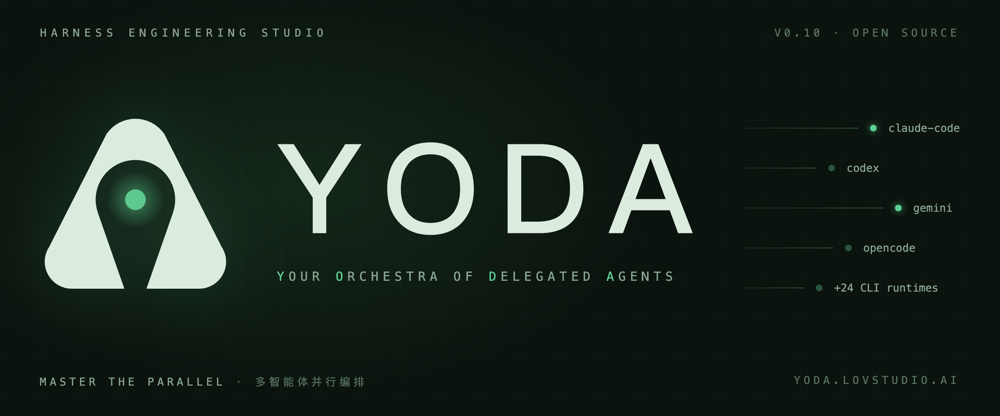

<p align="center">
  
</p>

<h1 align="center">Yoda</h1>

<p align="center">
  <strong>面向 Agentic Coding 的多智能体桌面编排器。</strong><br>
  <sub>在隔离的 git worktree 中并行运行多个编码代理，支持本地项目和 SSH 远程项目。</sub>
</p>

<div align="center">

[](./LICENSE.md)
[](https://github.com/lovstudio/yoda/releases)
[](https://github.com/lovstudio/yoda)
[](https://github.com/lovstudio/yoda/commits/main)
[](https://github.com/lovstudio/yoda/graphs/commit-activity)
<br>
[](https://discord.gg/f2fv7YxuR2)
[](https://www.ycombinator.com)
[](https://twitter.com/intent/follow?screen_name=lovstudio)

<br>

  <strong>
    <a href="https://github.com/lovstudio/yoda/releases/latest/download/yoda-arm64.dmg">macOS Apple Silicon</a>
    ·
    <a href="https://github.com/lovstudio/yoda/releases/latest/download/yoda-x64.dmg">macOS Intel</a>
    ·
    <a href="https://github.com/lovstudio/yoda/releases/latest/download/yoda-x64.msi">Windows</a>
    ·
    <a href="https://github.com/lovstudio/yoda/releases/latest/download/yoda-x86_64.AppImage">Linux AppImage</a>
  </strong>

<br><br>

[为什么选择](#why-yoda) · [亮点](#highlights) · [安装](#installation) · [提供商](#providers) · [架构](#architecture) · [技术栈](#tech-stack) · [贡献](#contributing) · [FAQ](#faq) · [致谢](#acknowledgements)

</div>

<br>

<a id="why-yoda"></a>

## 为什么选择 Yoda

现代编码代理已经足够强大，但同时管理多个代理很快会变得混乱：终端越来越多，分支互相冲突，任务上下文也容易丢失。Yoda 的核心目标很直接：**让多个编码代理并行工作，同时保持隔离、可审查、可合并。**

每个任务都会创建独立的 **git worktree**，可以在本地执行，也可以在 SSH 远程机器上执行。代理只在自己的工作区里改代码，你可以并行派发任务、查看 diff、介入会话、运行检查、归档或合并，而不需要在一堆终端和分支之间来回切换。

Yoda 不绑定单一模型或厂商。Claude Code、Codex、OpenCode、Gemini、Amp、Cursor、Copilot 等编码代理 CLI 都可以在同一套编排模型下运行。Linear、GitHub、Jira 等任务也可以直接进入会话，CI/CD 状态会在侧边栏中展示，让“任务 -> 代理 -> 审查 -> 发布”的流程集中在一个桌面应用里。

<a id="highlights"></a>

## 亮点

> **一个桌面应用，把"任务 → 多代理并行 → 审查 → 合并"收敛成一条可控的流水线。** 不绑定模型，不绑定厂商，本地优先。

四个核心差异点：

- **并行 worktree**：每个任务运行在独立的 `git worktree` 中，多个代理同时工作，不会踩到主工作区。
- **提供商无关**：带上你已经在用的编码代理 CLI——Claude Code、Codex、OpenCode、Gemini、Cursor、Copilot 等 [27 个 provider](#providers) 按任务自由切换。
- **从任务到会话**：Linear、Jira、GitHub/GitLab/Forgejo Issues、Plain 的 ticket 直接作为新会话提示词，CI/CD 状态在 diff 旁可见。
- **本地优先 + 跨平台**：应用状态存在本机 SQLite，Yoda 自身不上传你的代码；提供 macOS（Apple Silicon / Intel）、Windows、Linux 安装包。

<details>
<summary>更多能力</summary>

- **SSH 远程开发**：挂载远程机器上的项目，用和本地一致的流程运行代理。
- **移动端协作**：通过默认开启且带 token 的桌面 gateway 和 Expo 移动端，在手机上查看项目/任务状态并发起新需求。
- **审查与归档**：把任务标记为待审查，执行归档前命令，然后归档或合并。
- **内置 MCP**：按项目配置 Model Context Protocol servers，供支持 MCP 的代理共享使用。

</details>

<a id="installation"></a>

## 安装

安装包发布在 GitHub Releases，支持 macOS、Windows 和 Linux。

| 平台 | 下载 |
| --- | --- |
| macOS | [Apple Silicon DMG](https://github.com/lovstudio/yoda/releases/latest/download/yoda-arm64.dmg) · [Intel DMG](https://github.com/lovstudio/yoda/releases/latest/download/yoda-x64.dmg) · [Apple Silicon ZIP](https://github.com/lovstudio/yoda/releases/latest/download/yoda-arm64.zip) · [Intel ZIP](https://github.com/lovstudio/yoda/releases/latest/download/yoda-x64.zip) |
| Windows | [MSI 安装包](https://github.com/lovstudio/yoda/releases/latest/download/yoda-x64.msi) · [EXE 安装包](https://github.com/lovstudio/yoda/releases/latest/download/yoda-x64.exe) |
| Linux | [AppImage](https://github.com/lovstudio/yoda/releases/latest/download/yoda-x86_64.AppImage) · [Debian package](https://github.com/lovstudio/yoda/releases/latest/download/yoda-amd64.deb) · [RPM package](https://github.com/lovstudio/yoda/releases/latest/download/yoda-x86_64.rpm) |

> Homebrew 提醒：`brew install --cask yoda` 当前会解析到一个无关且已禁用的 Homebrew cask。在 LovStudio 官方 cask 发布前，请使用上面的 GitHub Releases 安装包。

**[全部版本](https://github.com/lovstudio/yoda/releases/latest)** · [更新日志](./CHANGELOG.md)

## SSH 远程开发

Yoda 可以通过 SSH/SFTP 连接远程机器，让你在远程代码库上工作，同时保留本地应用里的任务、终端、diff 和归档流程。认证支持 SSH agent、私钥和密码，凭据存储在操作系统钥匙串中。

更多实现细节见 [远程开发说明](./agents/workflows/remote-development.md)。

<a id="providers"></a>

## 提供商

### 编码代理

Yoda 的提供商系统是可扩展的。如果你使用的 CLI 还不在列表里，可以 [提交 issue](https://github.com/lovstudio/yoda/issues) 或发 PR。

| 提供商 | 安装方式 |
| --- | --- |
| [Amp](https://ampcode.com/manual#install) | `npm install -g @sourcegraph/amp@latest` |
| [Auggie](https://docs.augmentcode.com/cli/overview) | `npm install -g @augmentcode/auggie` |
| [Autohand Code](https://autohand.ai/code/) | `npm install -g autohand-cli` |
| [Charm Crush](https://github.com/charmbracelet/crush) | `npm install -g @charmland/crush` |
| [Claude Code](https://docs.anthropic.com/claude/docs/claude-code) | <code>curl -fsSL https://claude.ai/install.sh &#124; bash</code> |
| [Cline](https://docs.cline.bot/cline-cli/overview) | `npm install -g cline` |
| [Codebuff](https://www.codebuff.com/docs/help/quick-start) | `npm install -g codebuff` |
| [Codex](https://github.com/openai/codex) | `npm install -g @openai/codex` |
| [Continue](https://docs.continue.dev/guides/cli) | `npm i -g @continuedev/cli` |
| [Cursor](https://cursor.com/cli) | <code>curl https://cursor.com/install -fsS &#124; bash</code> |
| [Devin](https://cli.devin.ai/docs) | <code>curl -fsSL https://cli.devin.ai/install.sh &#124; bash</code> |
| [Droid (Factory)](https://docs.factory.ai/cli/getting-started/quickstart) | <code>curl -fsSL https://app.factory.ai/cli &#124; sh</code> |
| [Gemini](https://github.com/google-gemini/gemini-cli) | `npm install -g @google/gemini-cli` |
| [GitHub Copilot](https://docs.github.com/en/copilot/how-tos/set-up/install-copilot-cli) | `npm install -g @github/copilot` |
| [Goose](https://block.github.io/goose/docs/quickstart/) | <code>curl -fsSL https://github.com/block/goose/releases/download/stable/download_cli.sh &#124; bash</code> |
| [Hermes Agent](https://hermes-agent.nousresearch.com/docs/) | <code>curl -fsSL https://raw.githubusercontent.com/NousResearch/hermes-agent/main/scripts/install.sh &#124; bash</code> |
| [Jules](https://jules.google/docs/cli/reference/) | `npm install -g @google/jules` |
| [Junie](https://junie.jetbrains.com/docs/junie-cli.html) | <code>curl -fsSL https://junie.jetbrains.com/install.sh &#124; bash</code> |
| [Kilocode](https://kilo.ai/docs/cli) | `npm install -g @kilocode/cli` |
| [Kimi](https://www.kimi.com/code/docs/en/kimi-cli/guides/getting-started.html) | `uv tool install kimi-cli` |
| [Kiro (AWS)](https://kiro.dev/docs/cli/) | <code>curl -fsSL https://cli.kiro.dev/install &#124; bash</code> |
| [Letta](https://docs.letta.com/letta-code/cli) | `npm install -g @letta-ai/letta-code` |
| [Mistral Vibe](https://github.com/mistralai/mistral-vibe) | <code>curl -LsSf https://mistral.ai/vibe/install.sh &#124; bash</code> |
| [OpenCode](https://opencode.ai/docs/cli/) | `npm install -g opencode-ai` |
| [Pi](https://github.com/badlogic/pi-mono/tree/main/packages/coding-agent) | `npm install -g @mariozechner/pi-coding-agent` |
| [Qwen Code](https://github.com/QwenLM/qwen-code) | `npm install -g @qwen-code/qwen-code` |
| [Rovo Dev](https://support.atlassian.com/rovo/docs/install-and-run-rovo-dev-cli-on-your-device/) | `acli rovodev auth login` |

### 任务系统

Yoda 可以把 ticket、issue 和支持线程直接交给编码代理。

| 工具 | 认证方式 |
| --- | --- |
| [Linear](https://linear.app) | Linear API key |
| [Jira](https://www.atlassian.com/software/jira) | Site URL + email + Atlassian API token |
| [GitHub Issues](https://docs.github.com/en/issues) | OAuth，或 `gh auth login` |
| [GitLab Issues](https://docs.gitlab.com/user/project/issues/) | GitLab URL + PAT with `read_api` |
| [Forgejo Issues](https://forgejo.org/) | Forgejo URL + API token |
| [Plain Threads](https://www.plain.com/) | Plain API key |

<a id="architecture"></a>

## 架构

Yoda 是一个 Electron 桌面应用，主要分为三层：

- **Main process** (`src/main/`)：管理 SQLite 存储、Drizzle schema、PTY/session 编排、git worktree、SSH 隧道和 provider registry，并向 renderer 暴露类型化 RPC。
- **Renderer** (`src/renderer/`)：React + MobX UI，通过 React Query 读数据，通过 RPC 写数据，终端由 `node-pty` 和 xterm 前端协作呈现。
- **Shared** (`src/shared/`)：两端共享的类型、IPC contract 和编码代理 provider registry。
- **Mobile** (`apps/mobile/`)：Expo 应用，通过默认开启且带 token 的 desktop gateway 读取项目状态并提交新需求。

完整主题地图见 [`AGENTS.md`](./AGENTS.md) 和 [`agents/`](./agents/)。

<a id="tech-stack"></a>

## 技术栈

- **桌面框架**：Electron、electron-vite、electron-builder
- **前端**：React、MobX、TanStack Query、Radix UI、xterm.js、Tailwind CSS
- **移动端**：Expo、React Native
- **主进程**：TypeScript、Drizzle ORM、SQLite、node-pty、ssh2
- **集成**：GitHub、Linear、Jira、GitLab、Forgejo、Plain、MCP
- **质量与发布**：Vitest、ESLint、Prettier、Changesets、GitHub Actions

<a id="contributing"></a>

## 贡献

欢迎小而聚焦的 PR。开发环境、代码约定和新增 provider 的流程见 [Contributing Guide](CONTRIBUTING.md)。如果想讨论设计或 provider 需求，也可以加入 [Discord](https://discord.gg/f2fv7YxuR2)。

<a id="faq"></a>

## FAQ

<details>
<summary><b>Yoda 会收集哪些遥测数据？可以关闭吗？</b></summary>

> Yoda 只发送匿名、白名单内的事件，例如应用启动/关闭、功能使用名称、应用版本和平台版本。
> 不会发送代码、文件路径、仓库名、提示词或个人身份信息。
>
> **关闭遥测：**
>
> - 应用内：**设置 -> 通用 -> 隐私与遥测**，关闭开关
> - 或在启动前设置环境变量：`TELEMETRY_ENABLED=false`
>
> 事件白名单位于 [`src/shared/telemetry.ts`](./src/shared/telemetry.ts)。
</details>

<details>
<summary><b>我的数据保存在哪里？</b></summary>

> Yoda 是本地优先应用。应用状态保存在本地 SQLite 数据库：
>
> ```text
> macOS:   ~/Library/Application Support/yoda/yoda.db
> Windows: %APPDATA%\yoda\yoda.db
> Linux:   ~/.config/yoda/yoda.db
> ```
>
> **隐私说明：**Yoda 自身把数据保存在本地。但当你使用 Claude Code、Codex、Qwen 等编码代理时，对应 CLI 可能会把代码和提示词发送到它自己的云服务。每个 provider 都有自己的数据处理和保留政策。
>
> 如需重置本地数据库，退出应用后删除该文件即可，下次启动会重新创建。
</details>

<details>
<summary><b>Yoda 如何隔离多个代理？</b></summary>

> 每个任务都会获得独立的 **git worktree**，位于 Yoda 管理的目录下，和你的主工作区分离。代理只会看到自己的 worktree 文件，因此多个任务可以同时修改代码而不互相覆盖。任务完成后，你可以选择合并、cherry-pick 或归档。
</details>

<details>
<summary><b>如何添加新的 provider？</b></summary>

> Yoda 的 provider registry 设计为易扩展。
>
> - 按 [Contributing Guide](CONTRIBUTING.md) 提交 PR。
> - PR 需要包含 provider 名称、CLI 调用方式、认证说明和最小设置步骤。
> - provider 信息位于 `src/shared/agent-provider-registry.ts`，输出分类器位于 `src/main/core/conversations/impl/agent-event-classifiers/`。
>
> 如果不确定从哪里开始，可以先提交 issue，附上 CLI 链接和常用命令。
</details>

<details>
<summary><b>Yoda 需要哪些权限？</b></summary>

> - **文件系统 / Git**：读取和写入你的仓库，并创建用于隔离的 git worktree。
> - **网络**：供你选择的 provider CLI 使用，以及可选的 GitHub Actions 状态查询。
> - **本地数据库**：在本机 SQLite 中保存应用状态。
>
> Yoda 自身不会上传你的代码或会话。第三方 CLI 是否上传数据取决于各自的政策。
</details>

<details>
<summary><b>可以通过 SSH 处理远程项目吗？</b></summary>

> 可以。Yoda 支持 SSH 远程开发。
>
> **设置流程：**
>
> 1. 打开 **设置 -> SSH 连接**，添加服务器信息。
> 2. 选择认证方式：SSH agent、私钥或密码。
> 3. 添加远程项目，并填写服务器上的项目路径。
>
> **要求：**
>
> - 能够 SSH 登录远程服务器
> - 远程服务器已安装 Git
> - 如果使用 SSH agent 认证，需要本地 agent 已加载密钥，可用 `ssh-add -l` 检查
>
> 参考 [远程开发说明](./agents/workflows/remote-development.md) 获取更多细节。
</details>

## Star History

[](https://star-history.com/#lovstudio/yoda&Date)

<a id="acknowledgements"></a>

## 致谢

Yoda 是 LovStudio 独立维护和发布的项目。项目早期基于 General Action, Inc. 的 Emdash 演进而来，感谢 Emdash 项目提供的基础与启发。Emdash 仅作为上游项目和致谢对象出现，不代表当前项目身份、产品名称、发布方或背书关系。

## License

Apache-2.0 © LovStudio, with portions © General Action, Inc. See [LICENSE.md](./LICENSE.md).

<br>

<p align="center">
  <a href="https://x.com/lovstudio"></a>
</p>
