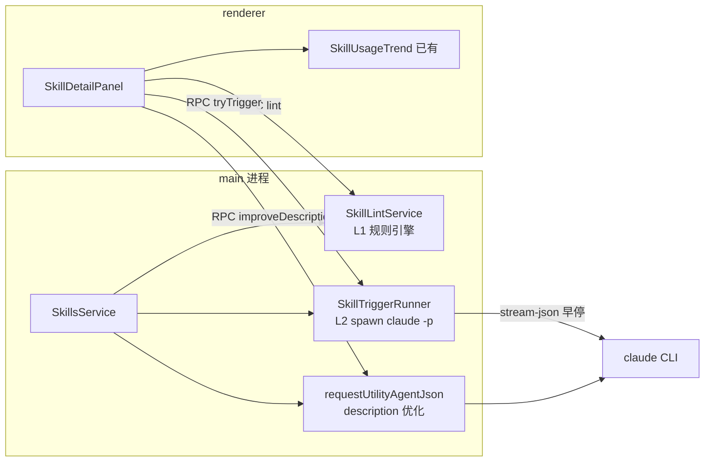

# 技能的检查、调试与迭代最佳实践解决方案

> 落点：通用方法论 + Yoda 产品能力规划（两者结合）
> 作者：手工川工作室 Lovstudio.ai · 2026-06-12 · v0.1

## 1. 结论摘要

1. **行业已收敛出一条「技能质量金字塔」**：静态校验 → 触发测试 → 执行评估 → 生产观测，四层各有成熟开源参照（anthropics/skills 的 skill-creator 脚本族、agnix linter、SkillsBench 基准），无需自研方法论。
2. **个人工作流**：直接采用 skill-creator 的 `quick_validate.py` + `eval-set.json` 触发测试模式，配合 agnix 做编辑期 lint，零成本即可建立完整 QA 链。
3. **Yoda 产品化**：现有技能域（SkillsService + 详情页 + 调用统计）已覆盖「生产观测」层的雏形，缺的是前三层。推荐按「校验规则补齐 → 触发试运行 → AI description 优化」三步落地，全部复用 Yoda 既有的 CLI spawn 架构，**不引入任何 API 依赖**。
4. 工作量量级：三个迭代约 8–13 人天，零基础设施成本（评估消耗用户自己的 Claude 订阅额度）。
5. 最大风险：headless `claude -p` 触发测试有随机性（需多次采样 + 阈值判定）与 token 消耗（需用户显式触发，不能后台静默跑）。

## 2. 需求理解与假设

- **目标用户**：① Mark 本人维护 `~/.claude/skills` 下 90+ 技能；② Yoda 用户在应用内管理/安装/创建技能。
- **核心场景**：技能写完后不知道「会不会触发、触发后行为对不对、上线后有没有人用、怎么改进」。
- **关键约束**：Yoda 所有 AI 能力走 CLI spawn（无 API client）；调用统计目前在 renderer localStorage；技能需同步到 7 个 agent（Claude/Codex/Cursor 等），跨 agent 兼容性是真实问题。
- **本方案假设**：评估以 Claude Code 为主 runtime，Codex 等只做 frontmatter 兼容性校验；不做云端 eval 服务。

## 3. 方法论：技能质量金字塔

业界（Anthropic 官方 + 社区）对「技能怎么测」已经收敛为四层，自下而上成本递增、信号递强：

```
            ┌─────────────────────┐
            │ L4 生产观测          │  调用统计、转录回看、observe-refine-test
            ├─────────────────────┤
            │ L3 执行评估 (evals)  │  evals.json expectations + grader agent
            ├─────────────────────┤
            │ L2 触发测试          │  eval-set.json: query × should_trigger
            ├─────────────────────┤
            │ L1 静态校验 (lint)   │  frontmatter 规则、命名、长度、结构
            └─────────────────────┘
```

### L1 静态校验

skill-creator 的 `quick_validate.py` 是事实标准，检查项：

| 检查项 | 规则 |
|---|---|
| SKILL.md 存在 | 技能根目录必须有 |
| frontmatter 字段白名单 | 仅允许 `name` `description` `license` `allowed-tools` `metadata` `compatibility`，多余键报错 |
| name | kebab-case，≤64 字符，禁首尾/连续连字符 |
| description | 必填，≤1024 字符，禁尖括号 |
| compatibility | ≤500 字符 |
| YAML | `---` 包裹、合法 dict |

社区更进一步的是 [agnix](https://github.com/agent-sh/agnix)：422 条规则覆盖 SKILL.md/CLAUDE.md/AGENTS.md/hooks/MCP，带 `--fix` 自动修复、LSP（编辑器实时诊断）和 WASM playground，跨 Claude Code/Codex/Cursor/Copilot 校验。

### L2 触发测试（trigger eval）

这是技能调试最高价值、最被忽视的一层——**大多数技能问题是「该触发时没触发 / 不该触发时误触发」**，根因几乎都在 description。skill-creator 的 `run_eval.py` 模式：

- 评估集 `eval-set.json`：`[{ "query": "...", "should_trigger": true|false }, ...]`，正例 + 负例都要有。
- 执行：对每条 query 跑 `claude -p <query> --output-format stream-json`，监听流事件，一旦出现 `Skill`/`Read` 工具调用即判定触发（早停，省 token）。
- 并行 10 worker，每条 query 跑多次取触发率，与 `trigger_threshold` 比较得 pass/fail。
- 配套 `improve_description.py` + `run_loop.py`：测不过 → AI 改写 description → 重测，自动迭代到收敛。

### L3 执行评估

`evals.json` 把任务期望写成 `expectations` 列表，由 grader agent 判定输出是否满足。这一层成本高（每条 eval 一次完整任务执行），只对核心技能值得做。Anthropic 官方推荐技能目录含 `evals/` 子目录（[Complete Guide to Building Skills](https://resources.anthropic.com/hubfs/The-Complete-Guide-to-Building-Skill-for-Claude.pdf)）。

### L4 生产观测与迭代

Anthropic 工程博客（[Equipping agents for the real world](https://www.anthropic.com/engineering/equipping-agents-for-the-real-world-with-agent-skills)）的核心循环：

1. **从评估出发**：先在代表性任务上观察 agent 哪里失败，再针对性写技能——不要凭空写。
2. **Claude A/B 双实例开发**：用一个 Claude 帮你写/改技能，另一个 Claude 实际执行任务来测它。
3. **observe-refine-test 循环**：看真实转录里的非预期轨迹（走错分支、过度依赖某个 reference），而不是看假设。

SkillsBench（[arXiv:2602.12670](https://arxiv.org/abs/2602.12670)，86 任务 × 11 领域 × 7308 轨迹）给了三个反直觉的硬数据：

- 精选技能平均 **+16.2pp** 通过率，但方差极大（软件工程 +4.5pp，医疗 +51.9pp），**16/84 任务出现负向效果**——技能不是越多越好，要测。
- **2–3 个模块的专注型技能 > 大而全文档**——SKILL.md 膨胀时拆 references/ 按需加载。
- **模型自生成技能平均零收益**——「让 AI 自己总结一个技能」不靠谱，必须人工策划 + 评估闭环。

## 4. 个人工作流方案（~/.claude/skills 维护）

| 环节 | 做法 | 工具 |
|---|---|---|
| 编辑期 | LSP 实时诊断 frontmatter/结构问题 | agnix（编辑器插件或 `npx agnix .`） |
| 提交前 | 静态校验 + 自动修复 | `agnix --fix-safe .` 或 skill-creator `quick_validate.py` |
| 新技能/改 description 后 | 触发测试：为重点技能维护 10–20 条 query 的 `eval-set.json`（含负例） | skill-creator `run_eval.py` 模式（直接安装 [skill-creator](https://github.com/anthropics/skills/blob/main/skills/skill-creator/SKILL.md)） |
| 触发不过 | AI 改 description → 重测循环 | `run_loop.py` / `improve_description.py` |
| 日常 | 看调用统计找僵尸技能（删）和高频技能（投入写 evals） | lovstudio/skillusage CLI |
| 大改版 | Claude A/B：一个会话改技能，另开干净会话跑真实任务验证 | 手动流程 |

**原则**（来自 SkillsBench）：低频技能只做 L1；高频技能做到 L2；核心差异化技能（如 lovstudio-skill-creator 本身）才做 L3。

## 5. Yoda 产品方案

### 现状 gap

| 金字塔层 | Yoda 现状 | Gap |
|---|---|---|
| L1 静态校验 | `validateSkillFrontmatter()` 仅查 description 必填+长度（`src/shared/skills/validation.ts:38-70`） | 缺 name 规则、字段白名单、YAML 结构、token 预算告警 |
| L2 触发测试 | 无 | 完全缺失，**最高价值缺口** |
| L3 执行评估 | 无 | 暂不做（成本/收益比低，见排除项） |
| L4 生产观测 | 详情页 30 天趋势图 + localStorage 统计（`skill-usage-stats.ts`） | 数据只覆盖 Yoda 内快捷命令调用，遗漏 CLI 直接调用 |
| 迭代辅助 | 创建有（CreateSkillModal），编辑=开文件夹 | 缺 AI description 优化、缺改后回归提示 |

### 推荐架构



- **L1**：把 quick_validate 全部规则移植进 `src/shared/skills/validation.ts`（纯函数，renderer/main 共用，已有 `SkillValidationIssue` 类型和卡片/详情页展示管道，零新 UI）。
- **L2**：新增 `skills.tryTrigger(skillId, queries[])` RPC——main 进程 spawn `claude -p <query> --output-format stream-json`，流式检测 Skill 工具调用即早停。详情页加「触发测试」区块：默认用 description 自动生成 3 正 2 负 query（走 utility agent），用户可编辑后点跑，结果矩阵展示触发率。**显式按钮触发，绝不后台跑**（烧用户额度）。
- **迭代闭环**：触发测试有 fail → 详情页出现「AI 优化描述」按钮 → `requestUtilityAgentJson` 生成新 description（输入：旧 description + 失败 query 列表）→ diff 预览 → 用户确认写回 SKILL.md → 提示重测。这是 `run_loop.py` 的产品化，但人在环。
- **L4 补强**：按既定路线把 localStorage 统计替换为 spawn `skillusage --json`（lovstudio/skillusage CLI），覆盖 Yoda 外的真实调用。

## 6. 技术选型

| 模块 | 首选方案 | 备选方案 | 排除方案 | 理由 |
|---|---|---|---|---|
| L1 规则引擎 | 移植 [quick_validate.py](https://github.com/anthropics/skills/blob/main/skills/skill-creator/scripts/quick_validate.py) 规则到现有 validation.ts（自研~150 行） | spawn [agnix](https://github.com/agent-sh/agnix) CLI | agnix WASM 内嵌——引入构建复杂度，422 规则大半针对 CLAUDE.md/hooks 与场景不符 | 规则量小且官方规范明确，移植成本 < 集成成本；KISS。后续若要跨 agent 深度校验再升级 agnix |
| L2 触发执行 | spawn `claude -p --output-format stream-json` + 早停检测（仿 [run_eval.py](https://github.com/anthropics/skills/blob/main/skills/skill-creator/scripts/run_eval.py)） | — | Anthropic API 直调——违反 Yoda「无 API client、全走 CLI spawn」铁律 | 与现有 PTY/spawn 基础设施同构；用户额度计费天然合理 |
| query 生成 / description 优化 | 复用 `requestUtilityAgentJson`（分支收尾流程已验证的模式） | — | 内置模板硬拼——质量差 | 已有成熟复用点，JSON schema 约束输出 |
| L4 统计 | spawn `lovstudio/skillusage --json` 替换 localStorage | 保持现状 | main 进程自己解析全部 transcript——与 skillusage CLI 重复造轮子 | 既定路线（CLI 已发 MVP），单一数据源 |
| 评估方法论参照 | [anthropics/skills skill-creator](https://github.com/anthropics/skills/tree/main/skills/skill-creator/scripts) + [SkillsBench](https://arxiv.org/abs/2602.12670) | — | 自创评估指标 | 官方管道 + 有 7308 轨迹实证的基准 |

**明确排除：L3 执行评估产品化。** 每条 eval 是一次完整 headless 任务（分钟级 + 大量 token），作为 GUI 内按钮体验差、烧额度凶。留给个人工作流用脚本跑；Yoda 只做到 L2 + L4 闭环已覆盖 80% 调试需求。

## 7. 实施路线

| 阶段 | 周期 | 工作内容 | 交付物 |
|---|---:|---|---|
| MVP（L1 补齐） | 1–2 天 | validation.ts 移植 quick_validate 全规则；详情页/卡片已有展示管道直接吃新 issue | 安装/创建/刷新时全量校验，问题列表含 name/字段白名单/YAML 错误 |
| V1（L2 触发测试） | 4–6 天 | `skills.tryTrigger` RPC + spawn 管理（超时/并发 2–3/取消）；详情页触发测试区块；utility agent 生成默认 query | 详情页可一键测「这个技能会被这些 query 触发吗」，结果矩阵 + 触发率 |
| V2（迭代闭环 + 统计换源） | 3–5 天 | AI 优化 description（diff 预览 + 写回）；localStorage → skillusage CLI spawn；改后「建议重测」标记 | 测→改→重测闭环；统计覆盖 CLI 直接调用 |

## 8. 成本估算

| 成本项 | 方案 | 估算 | 依据 |
|---|---|---:|---|
| 开发 | 自研（Yoda 仓库内） | 8–13 人天 | 三阶段合计；L1 几乎纯移植 |
| 基础设施 | 无新增 | ¥0 | 全本地 spawn |
| AI 调用 | 用户自有 Claude 订阅 | 每轮触发测试约 5 query × N 次采样的 claude -p 短会话 | 早停检测大幅压缩单次消耗 |

## 9. 风险与应对

| 风险 | 影响 | 应对 |
|---|---|---|
| 触发测试随机性（同 query 时触发时不触发） | 中 | 仿 run_eval：每 query 采样 ≥3 次报触发率而非布尔值；UI 明示「3/3」「1/3」 |
| headless claude -p 环境差异（项目上下文影响触发） | 中 | 在临时干净目录跑，仅注入被测技能；与 run_eval 的临时 commands 目录做法一致 |
| 用户误把触发测试当免费功能狂点 | 低 | 按钮带预估消耗提示；并发限 2–3；无自动重跑 |
| 移植规则与官方 quick_validate 漂移 | 低 | 规则表加注释链接源文件；版本号对齐 CATALOG_VERSION 机制 |
| Codex 等其他 runtime 触发语义不同 | 中 | V1 只测 Claude Code；compatibility 字段静态校验兜底其他 agent |

## 10. 下一步

1. **先验证 L2 可行性（半天 POC）**：手动对一个已装技能跑 `claude -p "<query>" --output-format stream-json`，确认流事件里能稳定识别 Skill 工具调用与早停时机。
2. MVP：移植 quick_validate 规则到 `src/shared/skills/validation.ts`（可直接开工，无依赖）。
3. 个人工作流即刻可用：`npx agnix ~/.claude/skills` 跑一遍现有 90+ 技能，清一轮静态问题。
4. 需确认的决策：V1 触发测试默认 query 由 AI 生成还是先让用户手填（推荐 AI 生成 + 可编辑）。

## 11. 参考来源

- https://www.anthropic.com/engineering/equipping-agents-for-the-real-world-with-agent-skills — 官方最佳实践（评估出发、A/B 双实例、observe-refine-test）
- https://github.com/anthropics/skills/tree/main/skills/skill-creator/scripts — quick_validate / run_eval / improve_description / run_loop 官方 QA 管道
- https://github.com/anthropics/skills/blob/main/skills/skill-creator/scripts/quick_validate.py — L1 校验规则全集
- https://arxiv.org/abs/2602.12670 — SkillsBench：+16.2pp 均值、高方差、专注型 > 大而全、自生成无效
- https://github.com/agent-sh/agnix — 422 规则 agent config linter（CLI/LSP/WASM）
- https://resources.anthropic.com/hubfs/The-Complete-Guide-to-Building-Skill-for-Claude.pdf — 官方技能构建指南（evals/ 目录推荐）
- Yoda 仓库现状：`src/main/core/skills/SkillsService.ts`、`src/shared/skills/validation.ts`、`src/renderer/features/skills/`
